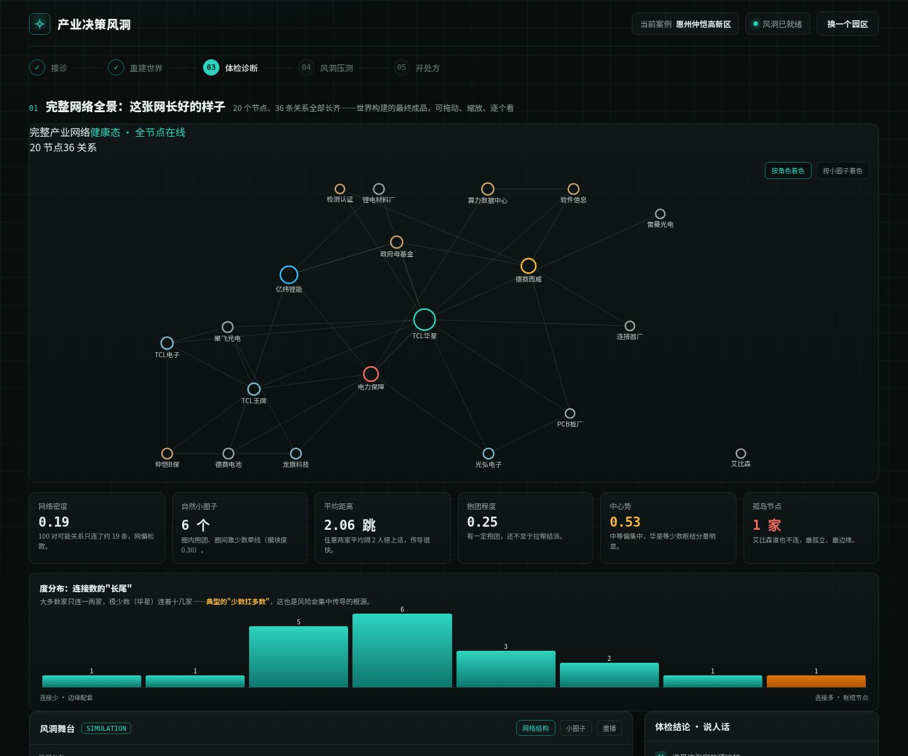
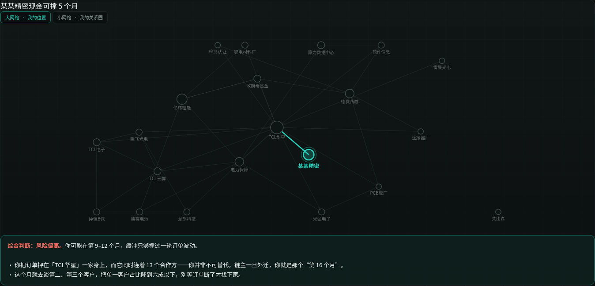
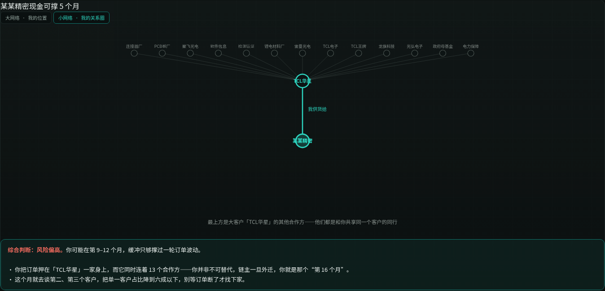

# 产业决策风洞 · Decision Windtunnel

> 把一张复杂的产业网络，扔进风洞里撞几遍——看清它**哪里先裂、沿什么路径传导、哪里有时滞、哪里比链主更脆弱**。

单文件、零依赖、可离线、免费开源的区域产业**决策体检**工具。以惠州仲恺高新区为第一张可替换的地图；不预测明年产值，只输出**产业叙事与结构分布**。

## 在线体验

**[https://zhanglingshare.github.io/decision-windtunnel/](https://zhanglingshare.github.io/decision-windtunnel/)**

无需注册、无需安装，浏览器打开即用。

## 它能做什么

- **重建一个产业世界**：喂入公开统计与企业名录，自动织成网络，并回放“文档翻开 → 实体飞出 → 关系生长 → 指标点亮”的构建过程。
- **全网 SNA 体检**：完整网络全景、密度 / 小圈子 / 平均距离 / 抱团度 / 中心势 / 孤岛、度分布长尾，一眼看出“少数节点扛多数连接”。
- **人话版基本盘**：把官方统计翻译成一句句大白话；红绿背离（产能在增、后劲投资在缩）自动标红。
- **把你的企业放进网里**：只填四项，立刻看到——
  - **大网络定位图**：“你”被脉冲高亮、其余变暗，看清你依附谁；
  - **ego 小网络关系圈**：你 → 大客户 → 一排共享客户的同行。
- **决策风洞（压测）**：链主外迁、芯片断供、订单外流、限电、人才流失、政策利好、技术突破……在冲击下看网络一步步怎么演化。

## 两阶段方法论

工具按“先扫描、后决策”组织，边界清晰：

| 阶段 | 做法 | 目的 |
|---|---|---|
| **① 全盘扫描** | 全量铺开、不收敛：世界构建奇观 / 角色卡墙 / 全网 SNA＋基本盘 / 轻访谈 | 看清基本盘与结构，可“逛”、可传播 |
| **② 决策模拟** | 收敛：仅 3–5 关键角色做有记忆、会博弈的 Agent，其余转类型化群体；六场压测、SEM 归因、ACH 反事实 | 试错与处方，服务决策 |

> 学 MiroFish 的“体验套路”保证传播，但不照搬“每个节点一个重型常驻 Agent”——重 Agent 只在决策阶段。

## 网络图：多张各司其职

不靠一张图解决所有问题——

1. **完整网络全景图**（健康态）
2. **全网结构统计图**（密度 / 社群 / 长尾）
3. **大网络定位图**（加入企业后高亮“你”）
4. **ego 小网络关系圈图**（你与客户、同行）
5. **风洞舞台图**（受冲击的网络）

## 本地运行（断网可用）

1. 下载 `index.html`；
2. 双击用浏览器打开即可。无需联网、无需安装，数据不上传。

## 替换成你的区域 / 园区

仲恺只是一张样板地图。支持导入 **CSV / JSON / TXT**，替换主体与关系，迁移到你的区县、园区或行业；可导出世界种子快照，形成可审计、可复现的决策档案。

## 它不是什么（边界声明）

- **不是预测器**：不预言明年 GDP、招商成败或具体企业命运。
- 每一次“退链”都是**特定参数下的相对推演**，不是现实预言。
- 当前为**弱涌现**仿真，主体量级远小于真实经济；反事实不可验证，但参数可对照公开统计核验。
- 不构成投资或经营建议；最终拍板的永远是人，工具只是照出思维盲区的一面镜子。

## 开源协议

[MIT](LICENSE) · 参数留数据血统（A 官方 / B 学术 / C 企业公开 / D 假设），推演过程可审计、可复盘。

## 相关项目

- [nosurvey-lab](https://github.com/zhanglingshare/nosurvey-lab)：研究生科研助手，公开数据替代问卷，SPSS→SmartPLS
- [zhongkai-simulator](https://github.com/zhanglingshare/zhongkai-simulator)：仲恺区域经济协同决策模拟器（前一版）
